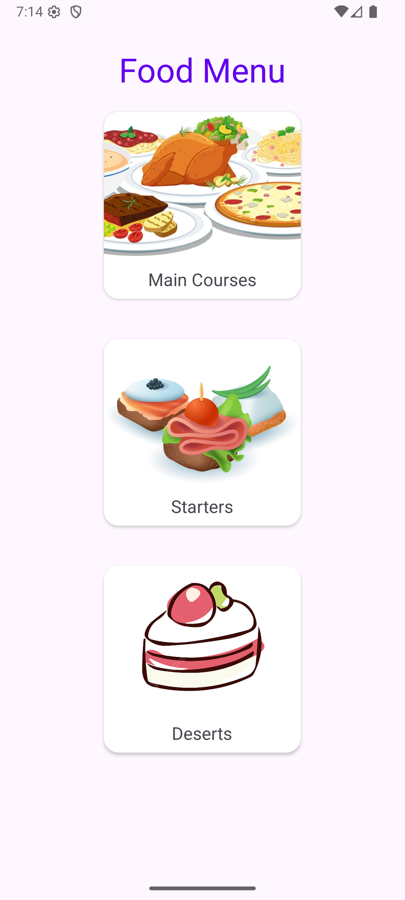
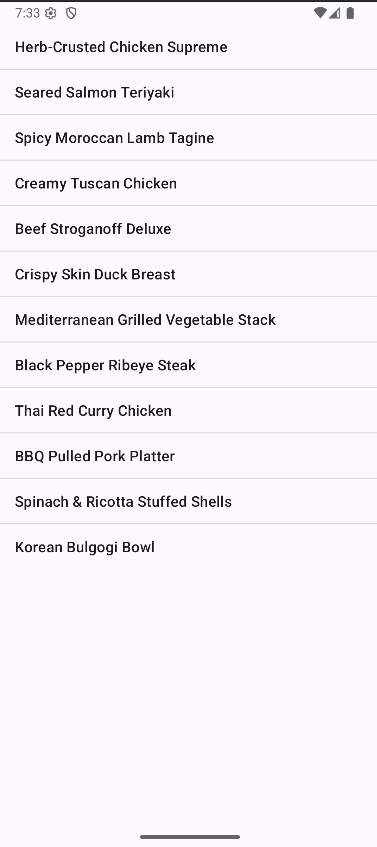

# BMI Calculator App

This is second Android app — **Food Menu and list views** built using **Java** and **Android Studio**.

## 📱 Features

- Main activity
- Link to second activity
- List view

## 🛠️ Technologies Used

- Java
- Android Studio
- Android XML layouts
- ImageViews

## 📸 Screenshots

** **

## 🚀 Getting Started

To run the project:

1. Clone this repo:
   ```bash
   git clone https://github.com/MaslaLT/Food_menu_android.git
